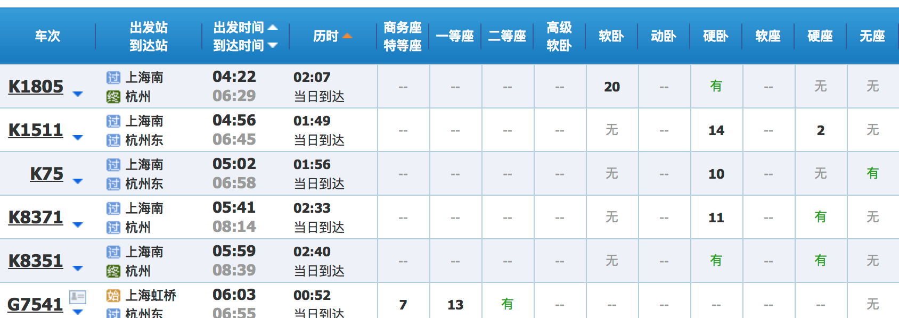

# 大作业：**火车订票系统**

实训目的：通过火车订票的项目训练，能够提高项目的分析与设计能力，以及在SSH/SpringMVC框架下开发程序的能力。

## 功能要求：

### 1.基本业务功能：

* 能够通过查询面板：

  查询出发站 到  到达站 ，某日期的火车票。

  > 参考页面如下：

  

* 可根据出发时间，到达时间，出发站，历时，票价等信息排序。

  > 车次参考面板如下：

  

### 2．高级业务功能

* 对于没有直达车次的站点

  能够通过查询面板点开“高级查询”：包括可选择 “最短路径“，”最便宜路径“，“中转站点”。

  车次面板：显示非直达站点之间的车次关系。

  > 参考页面如下：

  

### 3. 系统管理功能

* 用户管理：用户可根据用户名，密码登陆。

* 站点管理：包括站点名称，站点距离等。

* 车次管理：包括火车车次名称，出发时间，中间站点，中间站点停留时间，达到时间，各站点之间车价，提供等级（二等、一等、特等、硬座、软座等）等。

#### 1.技术要求

* 1、必须采用SSH/SpringMVC来完成主要的功能。

* 2、 Structs的标签可以不采用。

* 3、Hibernate部分可以采取模板里的自动生成模式，也可以自行编写映射文件。

* 4、Spring采用的注入方式可根据项目实际情况而定。

* 5、数据库可以采用mysql或者sqlserver等。

  * 6、表单前端处理需要有js来完成部分功能。

  * 7、数据库可以根据自己需要设计，数据内容可自行添加，满足演示要求即可。

  * 8、目录结构必须按照规范要求。

  * 9、车次站点以 数据结构（图） 建模。

  * 10、后续上课为上机时间：

    * 陆续安排为

      * 系统架构
      * 数据库设计与dao
      * jsp页面与action
      * service和美工

        * 项目小组课根据进度，每次课提交至少一部分内容或直接进行回答问题交流。

          > 包括：

          * 文件夹与体系架构初步方案
          * 数据库设计初步方案
          * 源代码
          * 系统演示与答辩

  * 11、 验收方式：演示系统，个别回答问题。

  * 12、 时间：本学期最后一次课结束之前。

#### 2.最终提交内容

* 1、文件夹结构说明文档：包括你的项目的所有的文件夹结  构，以及每个类（文件）的简要说明。

    > 其中

  * action是相关的servlet处理

  * service是中间层

  * dao是数据层

  * model是javabean。

  * src包括所有的java文件、配置文件

       > 参考目录结构1

      ​

  * webroot包括jsp、js、image、web-inf等，lib包括所有的jar包（web-inf下的class与jar不需要提交，web.xml等配置文件需要提交）。

      >参考目录结构2

      

  * 2、源代码：

      每个文件的最前面必须注释说明这个文件是谁创建、时间（这是问问题的主要依据）。以及后来谁修改过、时间的的信息；

      另外每个类中的方法，必须注明这个方法是做什么的，另外参数、返回值也需要说明。

  * 3、数据库：数据库sql文件。

## 数据库设计

* 1、 用户信息

      DROP TABLE IF EXISTS `user`;

      CREATE TABLE `user` (

      `user_id` int(11) NOT NULL AUTO_INCREMENT,

      `user_name` varchar(255) NOT NULL,

      `password` varchar(255) NOT NULL,

      PRIMARY KEY (`user_id`)
      ) ENGINE=InnoDB DEFAULT CHARSET=utf8;

* 2、火车信息

      DROP TABLE IF EXISTS `train`;

      CREATE TABLE `train` (

      `train_id` int(11) NOT NULL AUTO_INCREMENT,

      `train_name` varchar(255) NOT NULL,

      PRIMARY KEY (`train_id`)

      ) ENGINE=InnoDB DEFAULT CHARSET=utf8;

* 3、站点信息

      DROP TABLE IF EXISTS `station`;

      CREATE TABLE `station` (

      `station_id` int(11) NOT NULL,

      `station_name` varchar(255) NOT NULL,

      PRIMARY KEY (`station_id`)

      ) ENGINE=InnoDB DEFAULT CHARSET=utf8;

* 4、站点之间信息()

      DROP TABLE IF EXISTS `station_node`;

      CREATE TABLE `station_node` (

      `station_id_1` int(11) NOT NULL,

      `station_id_2` int(11) NOT NULL,

      `train_id` int(11) NOT NULL,

      `distance` double NOT NULL,

      `price_1` double NOT NULL,

      `price_2` double NOT NULL,

      `price_3` double NOT NULL,

      `arriver_time` datetime NOT NULL,

      `leave_time` datetime NOT NULL,

      PRIMARY KEY (`station_id_1`,`station_id_2`,`train_id`),

      KEY `station_node_ibfk_2` (`station_id_2`),

      KEY `train_id` (`train_id`),

      CONSTRAINT `station_node_ibfk_1` FOREIGN KEY (`station_id_1`) REFERENCES `station` (`station_id`) ON DELETE CASCADE ON UPDATE CASCADE,

      CONSTRAINT `station_node_ibfk_2` FOREIGN KEY (`station_id_2`) REFERENCES `station` (`station_id`) ON DELETE CASCADE ON UPDATE CASCADE,

      CONSTRAINT `station_node_ibfk_3` FOREIGN KEY (`train_id`) REFERENCES `train` (`train_id`) ON DELETE CASCADE ON UPDATE CASCADE
      ) ENGINE=InnoDB DEFAULT CHARSET=utf8;
